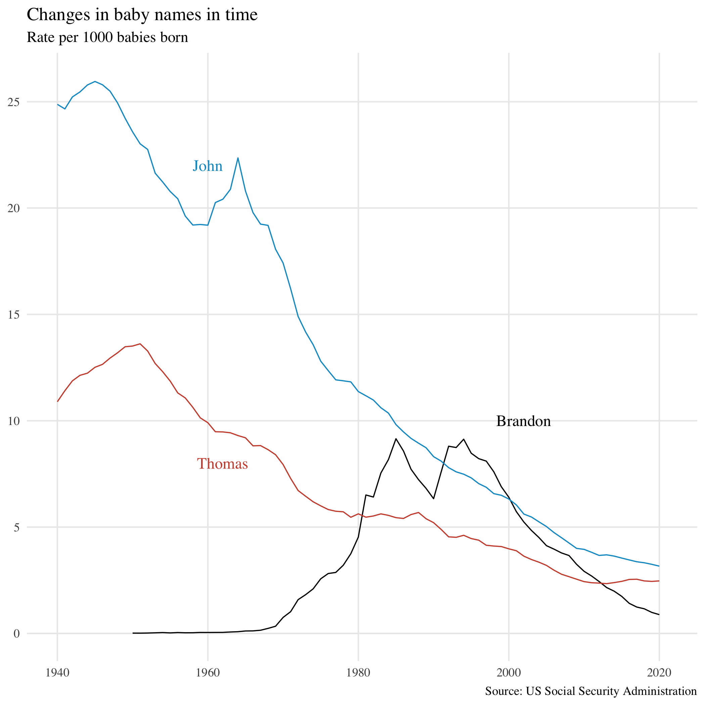
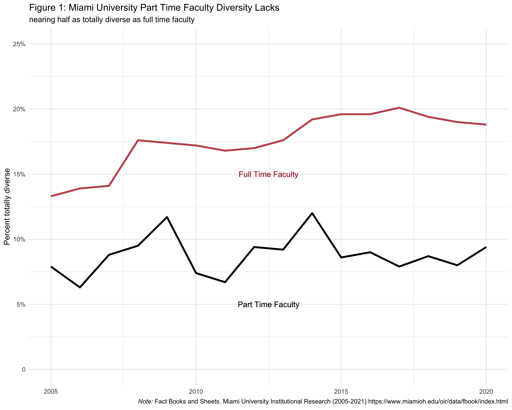

## Welcome to my Portfolio!

My name is Brandon Stoia and I'm a rising senior at Miami University with an expected graduation in May 2024. I'm an honors & university scholars student with a Bachelor of Arts in Data Analytics and a Bachelor of Science in Data Science & Statistics with a minor in Business Analytics. This repository contains my explorations as I progress in my knowledge of the data science workflow. 

## Ohio COVID Surges and Unemployment
- This project included reading data from the Ohio COVID Dashboard and also accessing unemployment data from the Bureau of Labor Statistics API.
- Using ggplot in R, I created this dashboard of COVID and Unemployment facts.

## World Happiness
- Using the Gapminder Happiness Scores index, I created a chloropleth of the world mapping happiness.

## Baby Name Project!
- Using data from the US Social Security Administration, I created a plot comparing most common baby names starting with each letter for babies in 2020.

- I compared how common my name is to my professors' names.

- I looked into baby names that are nearly equally split by gender.

## My Hometown
- Using Google Earth and county data from the R libraries ggplot2 and maps, I created a visual mapping my hometown.

## Diversity at Miami University
- Using data from my university's Common Data Set, I explored diversity in faculty and students.
- I found that full time faculty has consistently been about twice as diverse as part time faculty over time. 

- Following the pandemic, many minorities at Miami University saw a decrease in their representation in faculty.
- Latinx Miami Students see the least amount of representation in faculty, Black students see the biggest decrease in representation.

